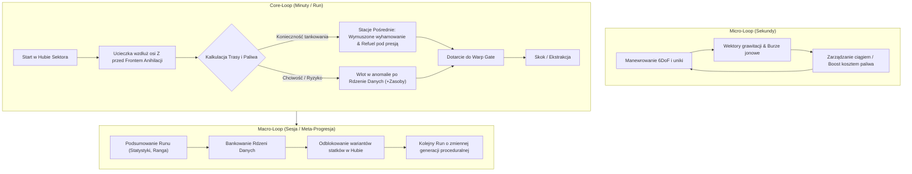

# GAMEPLAY.MD - AD ASTRA GAME DESIGN & CORE LOOP

## 1. HIGH CONCEPT & EXPERIENCE GOALS
**AdAstra** to kosmiczny survival-eksplorator w formule roguelike (krótkie runy 5–8 minut). Gracz wciela się w pilota statku badawczo-ewakuacyjnego uciekającego z zapadającego się sektora przestrzeni kosmicznej przed **Frontem Anihilacji** (falą niszczycielskiej energii).

Gra łączy precyzyjny pilotaż arcade/6DoF z napięciem wynikającym z zarządzania zasobami (paliwo, kadłub) oraz presją nieubłaganie nadciągającej ściany zagłady.

---

## 2. TRÓJPOZIOMOWY GAMEPLAY LOOP

### 2.1. Pętla Mikro (Sekundy)
* Pilotaż statkiem w przestrzeni 3D z użyciem sił fizycznych `Rigidbody`.
* Omijanie dryfujących asteroidów i wykorzystywanie asysty grawitacyjnej anomalii.
* Balansowanie użyciem sprintu/boostu (prędkość ucieczki vs 2.2x drenaż paliwa).

### 2.2. Pętla Rdzenna (Minuty / Pojedynczy Run)
1. **Start:** Wylot ze stacji bazowej (`StartingHub`, Z=0) w kierunku bramy skokowej (`Warp Gate`, Z=4000).
2. **Presja Czasu:** Za plecami gracza przesuwa się **Front Anihilacji**, odcinając drogę powrotną.
3. **Wymuszony Postój:** Bak paliwa mieści maksymalnie 60% dystansu sektora – bezpośredni lot w linii prostej bez tankowania jest niemożliwy.
4. **Zarządzanie Ryzykiem:**
   - Gracz musi zidentyfikować stację pośrednią (Outpost / Wreck) i **całkowicie wyhamować w strefie `RefuelZone`**, obserwując zbliżający się front fali.
   - Gracz decyduje, czy zaryzykować wlot w głąb burzy jonowej lub na krawędź anomalii grawitacyjnej, by przechwycić **Rdzenie Danych (Data Cores)**.
5. **Ekstrakcja:** Wlot do aktywnej bramy Warp Gate kończy run sukcesem.

### 2.3. Pętla Makro (Meta-Progresja i Regrywalność)
* **Proceduralny Pas Sektora:** W każdym podejściu losowane są pozycje stacji pośrednich, układ pasów asteroid oraz rozkład anomalii w korytarzu ucieczki.
* **Rdzenie Danych (Dual-Use):**
  - *W trakcie lotu:* natychmiast odnawiają +25% paliwa lub naprawiają kadłub.
  - *Po udanej ekstrakcji:* służą jako waluta w Hubie do odblokowania predefiniowanych wariantów statku (np. Lekki Zwiadowca, Ciężki Frachtowiec).

---

## 3. WARUNKI ZWYCIĘSTWA I PORAŻKI

### 3.1. Zwycięstwo (Run Complete)
* Wlot statkiem w collider bramy **Warp Gate** przed dogonieniem przez Front Anihilacji.
* Ekran podsumowania: czas ucieczki, zachowane zasoby, liczba dowiezionych Rdzeni Danych, ranga pilotażu.

### 3.2. Porażka (Game Over)
* **Destrukcja Kadłuba (`Health <= 0`):** Zderzenia z asteroidami o dużej prędkości względnej lub uderzenia piorunów w burzy jonowej.
* **Pochłonięcie przez Front Anihilacji:** Wpadnięcie w strefę śmiertelnego promieniowania.
* **Wytracenie Ciągu (Brak Paliwa):**
  - Przy `Fuel == 0` silniki gasną, statek dryfuje na resztkach wektora pędu.
  - Bezradny dryf kończy się uderzeniem w przeszkodę lub wchłonięciem przez nadciągający Front Anihilacji.

---

## 4. GŁÓWNE MECHANIKI DYNAMIZUJĄCE

### 4.1. Front Anihilacji (The Annihilation Wave)
Liniowa ściana energii przesuwająca się ze stałą prędkością wzdłuż osi ucieczki sektora:
1. **Strefa Ostrzegawcza (50–100 m przed frontem):**
   - Zakłócenia HUD, czerwone pulsowanie oświetlenia kokpitu, audio sygnałów alarmowych zbliżeniowych.
   - Wskaźnik w HUD pokazujący dokładny dystans do fali w metrach.
2. **Front Niszczący:**
   - Zadaje gwałtowne obrażenia kadłubowi co sekundę (`IDamageable`).
   - Pozwala na dramatyczną ucieczkę "w ostatniej chwili", jeśli gracz zużyje resztki paliwa na boost.

### 4.2. Stacje Pośrednie (Dead-Stop Refuel)
* Wymagają wyhamowania statku wewnątrz sfery ochronnej.
* Gracz podejmuje decyzję o przerwaniu tankowania i ucieczce, gdy widzi zbliżające się wskaźniki zagrożenia fali.

### 4.3. Rdzenie Danych (Data Cores)
* Unoszące się w przestrzeni kapsuły/kontenery, zlokalizowane głównie w strefach wysokiego ryzyka (wnętrza Burz Jonowych, orbity Anomalii Grawitacyjnych).
* Zapewniają natychmiastowy zastrzyk zasobów w locie oraz stanowią bazę meta-progresji.

---

## 5. ROZWÓJ I SYSTEMY W FAZIE PROJEKTOWEJ (BACKLOG / POST-MVP)

* **Sygnał SOS (Distress Beacon) [Status: UNDER REVIEW / POST-MVP]:**
  - Mechanika ratunkowa w trakcie bezradnego dryfu po wyczerpaniu paliwa.
  - Planowane wdrożenie: interaktywna mini-gra nasłuchowa lub sygnał awaryjny o podwójnym skutku (zrzut ratunkowy vs sprowadzenie katastrofy).
  - W MVP faza dryfu kończy się pochłonięciem przez Front Anihilacji.
* **Zaawansowane Dokowanie:**
  - Wymóg precyzyjnego wyrównania kątowego statku ze śluzą stacji (obecnie MVP wykorzystuje sferyczny trigger `RefuelZone`).
