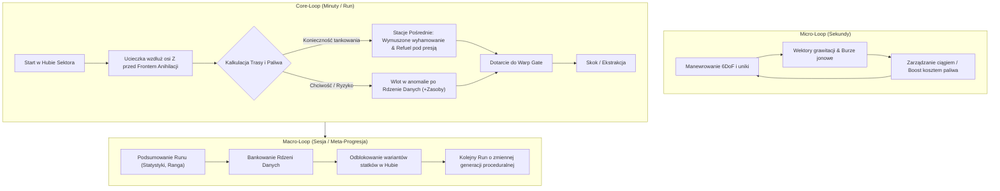

# GAMEPLAY.MD - AD ASTRA GAME DESIGN & CORE LOOP

## 1. HIGH CONCEPT & EXPERIENCE GOALS
**AdAstra** to kosmiczny survival-eksplorator w formule roguelike (krótkie runy 5–8 minut). Gracz wciela się w pilota statku badawczo-ewakuacyjnego uciekającego z zapadającego się sektora przestrzeni kosmicznej przed **Frontem Anihilacji** (falą niszczycielskiej energii).

Gra łączy precyzyjny pilotaż arcade/6DoF z napięciem wynikającym z zarządzania zasobami (paliwo, kadłub) oraz presją nieubłaganie nadciągającej ściany zagłady.

---

## 2. TRÓJPOZIOMOWY GAMEPLAY LOOP

### 2.1. Pętla Mikro (Sekundy)
* Pilotaż statkiem w przestrzeni 3D z użyciem sił fizycznych `Rigidbody`.
* Omijanie dryfujących asteroidów i wykorzystywanie asysty grawitacyjnej anomalii.
* Balansowanie użyciem sprintu/boostu (prędkość ucieczki vs 2.2x drenaż paliwa).

### 2.2. Pętla Rdzenna (Minuty / Pojedynczy Run)
1. **Start:** Wylot ze stacji bazowej (`StartingHub`, Z=0) w kierunku bramy skokowej (`Warp Gate`, Z=4000) w autorskim korytarzu testowym (`SampleScene.unity`).
2. **Nawigacja i Presja Czasu:** Wskaźniki HUD (Waypoints) wskazują kierunek i dystans w metrach do aktywnego celu (stacja pośrednia, Warp Gate). Za plecami gracza przesuwa się ze stałą prędkością **Front Anihilacji**.
3. **Wymuszony Postój:** Bak paliwa mieści maksymalnie ~60% dystansu sektora – bezpośredni lot w linii prostej bez tankowania jest niemożliwy.
4. **Zarządzanie Ryzykiem:**
   - **Stacja Pośrednia (Dead-Stop & Magnes Dokujący):** Gracz musi wyhamować wewnątrz strefy `RefuelZone`. Magnes dokujący unieruchamia statek na czas trwania procedury tankowania, podczas gdy gracz obserwuje zbliżający się wskaźnik fali.
   - **Strefy Zagrożenia:** Gracz decyduje, czy zaryzykować wlot w głąb burzy jonowej lub na krawędź anomalii grawitacyjnej, by przechwycić **Rdzenie Danych (Data Cores)**.
5. **Ekstrakcja:** Wlot do aktywnej bramy Warp Gate kończy run sukcesem.

### 2.3. Pętla Makro (Meta-Progresja i Persystencja)
* **Układ Sektora w MVP:** Autorski korytarz testowy (greybox / blockout) w `SampleScene.unity`. Proceduralny generator całego sektora wzdłuż osi Z odłożony jest do POST-MVP.
* **Rdzenie Danych (Dual-Use):**
  - *W trakcie lotu:* natychmiast odnawiają część zasobów (+25% paliwa lub naprawa kadłuba).
  - *Po udanej ekstrakcji:* służą jako waluta do odblokowania predefiniowanych wariantów statku (np. Lekki Zwiadowca, Ciężki Frachtowiec).
* **Persystencja Meta-Progresji:** Lekki zapis do `PlayerPrefs` (zbankowane rdzenie oraz odblokowane statki). Implementacja kodu hangarowego wariantów statku nastąpi po ustabilizowaniu pętli rdzennej.

---

## 3. WARUNKI ZWYCIĘSTWA I PORAŻKI

### 3.1. Zwycięstwo (Run Complete)
* Wlot statkiem w collider bramy **Warp Gate** przed dogonieniem przez Front Anihilacji.
* Ekran podsumowania: czas ucieczki, zachowane zasoby, liczba dowiezionych Rdzeni Danych, ranga pilotażu.
* Zapis zebranych rdzeni do sumy zbankowanych punktów (`PlayerPrefs`).

### 3.2. Porażka (Game Over)
* **Destrukcja Kadłuba (`Health <= 0`):** Zderzenia z asteroidami o dużej prędkości względnej, uderzenia piorunów w burzy jonowej lub obrażenia od Fali Anihilacji.
* **Pochłonięcie przez Front Anihilacji:** Wpadnięcie w strefę niszczącej energii (gwałtowny Rapid DPS redukujący kadłub do zera).
* **Wytracenie Ciągu (Brak Paliwa - Stan Dead-Stick):**
  - Przy `Fuel == 0` silniki główne oraz mikro-silniki manewrowe RCS gasną. Gracz traci całkowitą kontrolę nad wektorem pędu i rotacją.
  - Sam brak paliwa **nie wywołuje natychmiastowego Game Over** – statek dryfuje siłą bezwładności. Game Over następuje dopiero w momencie fizycznej kolizji z przeszkodą lub wchłonięcia przez Front Anihilacji. Gracz ma teoretyczną szansę "wdryfować" siłą pędu w strefę stacji paliw.

---

## 4. GŁÓWNE MECHANIKI DYNAMIZUJĄCE

### 4.1. Front Anihilacji (The Annihilation Wave)
Liniowa ściana energii przesuwająca się ze stałą prędkością wzdłuż osi ucieczki sektora (oś Z):
1. **Strefa Ostrzegawcza (50–100 m przed frontem):**
   - Czerwony tint ekranu, pulsowanie oświetlenia kokpitu, audio sygnałów alarmowych zbliżeniowych.
   - Wskaźnik w HUD pokazujący dokładny dystans do fali w metrach.
2. **Front Niszczący:**
   - Zadaje gwałtowne obrażenia kadłubowi co sekundę (`IDamageable.TakeDamage`, Rapid DPS).
   - Pozwala na dramatyczną ucieczkę "w ostatniej chwili", jeśli gracz posiada resztki paliwa na sprint.

### 4.2. Stacje Pośrednie (Dead-Stop Refuel & Magnes Dokujący)
* Wymagają zredukowania prędkości poniżej progu wewnątrz sfery stacji.
* Po wyhamowaniu magnes dokujący stabilizuje i unieruchamia statek na czas trwania procedury tankowania.
* Gracz pod presją obserwuje zbliżający się wskaźnik Fali Anihilacji. Po napełnieniu następuje odcumowanie i wznowienie lotu.

### 4.3. Rdzenie Danych (Data Cores)
* Unoszące się w przestrzeni kapsuły/kontenery zlokalizowane w strefach wysokiego ryzyka (wnętrza Burz Jonowych, orbity Anomalii Grawitacyjnych).
* Zapewniają natychmiastowy zastrzyk zasobów w locie oraz stanowią bazę meta-progresji bankowanej po wlocie w Warp Gate.

---

## 5. ROZWÓJ I SYSTEMY W FAZIE PROJEKTOWEJ (BACKLOG / POST-MVP)

* **Sygnał SOS (Distress Beacon) [Status: UNDER REVIEW / POST-MVP]:**
  - Mechanika ratunkowa w trakcie bezradnego dryfu po wyczerpaniu paliwa.
  - Planowane wdrożenie: interaktywna mini-gra nasłuchowa lub sygnał awaryjny o podwójnym skutku (zrzut ratunkowy vs sprowadzenie katastrofy).
  - W MVP faza dryfu Dead-Stick kończy się zderzeniem lub pochłonięciem przez Front Anihilacji.
* **Proceduralny Generator Sektora:**
  - Dynamiczne rozstawianie korytarza stacji i anomalii w osi Z (w MVP zastąpione autorskim blockoutem w `SampleScene.unity`).
* **Zaawansowane Dokowanie:**
  - Wymóg precyzyjnego wyrównania kątowego statku ze śluzą stacji (obecnie MVP wykorzystuje sferyczny trigger i magnes dokujący).
