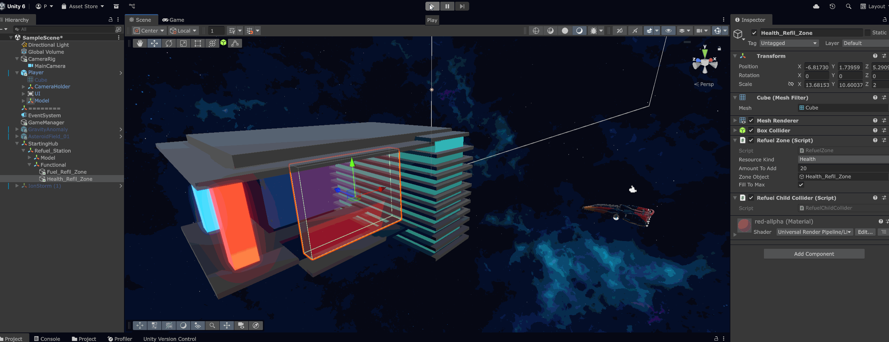

# Devlog 1 - podstawy rozgrywki

Krótki log pokazujący aktualnie zaimplementowane mechaniki: sterowanie statkiem, kamerę, UI zasobów oraz pierwsze interaktywne lokacje.

## Sterowanie statkiem i kamera

Statek korzysta z `Rigidbody` oraz Unity Input System.

Gracz może lecieć do przodu i na boki, obracać statek myszą, wykonywać roll oraz sprintować.
Kamera płynnie podąża za statkiem, reaguje na roll i zwiększa FOV podczas sprintu.

Skrypty: [Player_Spaceship.cs](../../Scripts/Player/Spaceship/Player_Spaceship.cs), [DynamicCamera.cs](../../Scripts/Player/DynamicCamera.cs), [PlayerThrusterFXController.cs](../../Scripts/Player/Spaceship/PlayerThrusterFXController.cs)

## HUD: paliwo i zdrowie

HUD wyświetla aktualny poziom paliwa i zdrowia statku. Paliwo spada podczas ruchu, a sprint zużywa je szybciej. Zdrowie jest obsługiwane przez wspólny interfejs obrażeń, dzięki czemu może reagować na zagrożenia z lokacji.

Skrypty: [UI_Manager.cs](../../Scripts/Player/UI_Manager.cs), [FuelSystem.cs](../../Scripts/Player/Spaceship/FuelSystem.cs), [HealthSystem.cs](../../Scripts/Player/Spaceship/HealthSystem.cs), [IDamageable.cs](../../Scripts/Interfaces/IDamageable.cs)

## Pole asteroid

Generator tworzy losowe pole asteroid z prefabów, nadając im pozycję, skalę, 
kolizje, `Rigidbody`, początkową siłę oraz rotację. 

Dzięki temu lokacja dodaje trudności w eksploracji.

Skrypt: [AsteroidFieldGenerator.cs](../../Scripts/Locations/AsteroidField_01/AsteroidFieldGenerator.cs)

## Mgła / burza jonowa

Strefa mgły - przeszkoda polegająca na niebezpiecznym obszarze.

Po wejściu gracza uruchamia losowe zdarzenia: najpierw pojawia się ostrzeżenie VFX, a po opóźnieniu obrażenia są naliczane tylko wtedy, gdy gracz nadal znajduje się w zagrożonym obszarze.

Skrypty: [FogEventController.cs](../../Scripts/Locations/IonStorm/FogEventController.cs), [HealthSystem.cs](../../Scripts/Player/Spaceship/HealthSystem.cs)

## Anomalia grawitacyjna

Anomalia wyszukuje obiekty z `Rigidbody` w zasięgu, przyciąga je do centrum i dodaje siłę styczną, 
tworząc ruch orbitalny.
Przy krawędzi pola zwiększa siłę przyciągania oraz tłumi prędkość, żeby obiekty nie uciekały zbyt łatwo z orbity.

(Mechanika działa odwrotnie niż w rezeczywistości - na potrzeby gry)
