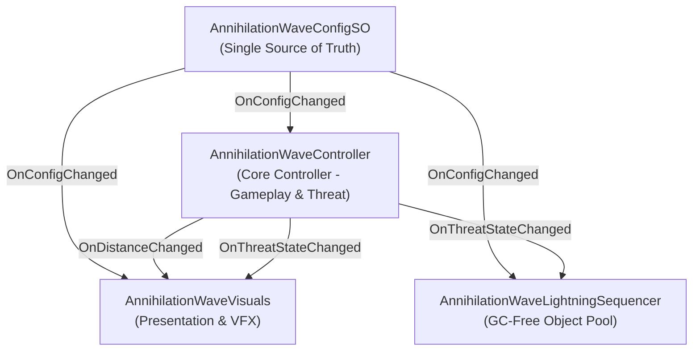

# THESIS_NOTES.md - MATERIAŁY I NOTATKI DO PRACY INŻYNIERSKIEJ

> [!NOTE]
> **UWAGA DLA AGENTÓW AI / PROTOKÓŁ PROJEKTOWY:**
> Niniejszy plik służy wyłącznie celom edukacyjnym i przygotowaniu materiałów do pracy inżynierskiej użytkownika.
> Agenci AI **NIE powinni go analizować, traktować jako wytycznych projektowych ani egzekwować zawartych tu treści** podczas bieżących prac nad kodem.
> Plik zawiera na ten moment luźne notatki techniczne, koncepcyjne i architektoniczne – jego ostateczny format i zakres nie zostały jeszcze ustalone.

---

## 1. Architektura Zagrożenia: Fala Anihilacji (The Annihilation Wave)

W toku refaktoryzacji monolit `AnnihilationWaveController` (posiadający ponad 600 linii kodu) został podzielony zgodnie z zasadami **Single Responsibility Principle (SRP)** oraz **Separation of Concerns (SoC)** na trzy wyspecjalizowane moduły połączone architekturą sterowaną zdarzeniami (*Event-Driven Architecture*):

### A. Moduł Rdzenny: Core Controller (`AnnihilationWaveController`)
* **Odpowiedzialność:** Czysta logika rozgrywki i fizyki hazardu środowiskowego.
* **Cechy implementacyjne:**
  * Ruch kinetyczny wzdłuż osi Z oparty o `Rigidbody.MovePosition` w cyklu `FixedUpdate`.
  * Wyliczanie odległości algebraicznej do gracza (tzw. *signed distance*) za pomocą iloczynu skalarnego `Vector3.Dot(toPlayer, transform.forward)`.
  * Ewaluacja stanów zagrożenia (*Finite State Machine*): `Safe` -> `Warning` -> `Critical` -> `Engulfed`.
  * Zadawanie ciągłych obrażeń kontaktowych (*Rapid DPS*) za pośrednictwem interfejsu `IDamageable.TakeDamage`. Matematyczna weryfikacja granicy ($Z \le 0$) zapewnia 100% niezawodności i odporność na zjawisko tunelowania (*collision tunneling*) przy dużych prędkościach statku.
  * Całkowite odseparowanie od kodu cząsteczek, materiałów czy shaderów – komunikacja z otoczeniem odbywa się wyłącznie poprzez zdarzenia `Action<float> OnDistanceChanged` oraz `Action<WaveThreatState> OnThreatStateChanged`.

### B. Moduł Prezentacji i Efektów: VFX (`AnnihilationWaveVisuals`)
* **Odpowiedzialność:** Warstwa audiowizualna i sprzężenie zwrotne dla gracza (*Sensory Feedback*).
* **Cechy implementacyjne:**
  * **Infinite-Horizon Centering:** Dynamiczne wyrównywanie kontenera wizualnego `visualRoot` do współrzędnych $X, Y$ statku gracza w `LateUpdate`. Eliminuje widoczne krawędzie fali w otwartej przestrzeni 3D.
  * **MaterialPropertyBlock (Nieniszczący rendering):** Wstrzykiwanie parametrów shadera plazmowego (`_Speed1`, `_Speed2`, `_PulseSpeed`, `_VoronoiScale`, `_VoronoiPower`, `_EdgeNoiseDistortion`) bezpośrednio do bufora GPU per-renderer, bez modyfikowania współdzielonego assetu materiału (`.mat`) na dysku.
  * **Modulacja Iskrzenia:** Dynamiczna zmiana współczynnika emisji `ParticleSystem` w zależności od zbliżania się fali.
  * **Oświetlenie URP:** Płynne podbijanie intensywności i częstotliwościowe migotanie światła ostrzegawczego (`Light` / `UniversalAdditionalLightData`).

### C. Sekwenser Wyładowań Atmosferycznych (`AnnihilationWaveLightningSequencer`)
* **Odpowiedzialność:** Losowe wyładowania piorunowe wzdłuż frontu fali.
* **Cechy implementacyjne:**
  * **GC-Free Object Pooling:** 12-elementowa pula instancji piorunów tworzona przy starcie.
  * **Optymalizacja pamięci:** Pre-buforowanie tablic `ParticleSystem[]` w strukturze `PooledDischarge`, eliminujące wywołania `GetComponentsInChildren` w trakcie gry.
  * **Zegar czasowy zamiast Coroutine:** Wyłączanie wyładowań na podstawie porównania `Time.time >= deactivateTime` w `LateUpdate`, eliminujące ciągłe alokacje `StartCoroutine` oraz instancji `new WaitForSeconds()`.
  * **Dynamika burzy:** Częstotliwość uderzeń skaluje się automatycznie na podstawie zdarzenia `OnThreatStateChanged` (np. interwały skrócone o 65% w strefie krytycznej).

---

## 2. Wzorce Architektoniczne i Dobre Praktyki Unity

### A. ScriptableObject jako Pojedyncze Źródło Prawdy (Single Source of Truth)
* **Problem badawczy:** W tradycyjnym podejściu parametry balansu (prędkość, dystanse, obrażenia) są deklarowane w komponentach `MonoBehaviour`. Skutkuje to duplikacją danych, rozproszeniem konfiguracji w scenach/prefabach oraz trudnością w globalnym strojeniu balansu (tzw. problem *split-brain state*).
* **Zastosowane rozwiązanie:** Wydzielenie wszystkich parametrów do `AnnihilationWaveConfigSO` dziedziczącego po `ScriptableObject`. Kontrolery pobierają wartości bezpośrednio z assetu konfiguracyjnego.
* **Literatura:**
  1. *Unity Technologies: "Create modular game architecture in Unity with ScriptableObjects"* (Official E-book, 2023).
  2. *Ryan Hipple (Schell Games): "Game Architecture with Scriptable Objects"* (Unite Austin 2017).
  3. *Unity Manual: "ScriptableObject Architecture & Data Decoupling"*.

### B. Live-Tuning w Edytorze i Wzorzec Obserwatora (`[ExecuteAlways]` + `OnConfigChanged`)
* `AnnihilationWaveConfigSO` definiuje zdarzenie `public event Action OnConfigChanged`, wywoływane w edytorze w metodzie `OnValidate()`.
* Komponenty nasłuchujące subskrybują to zdarzenie w `OnEnable()`.
* Atrybut `[ExecuteAlways]` pozwala na odbieranie zdarzeń i podgląd modyfikowanych parametrów w oknie Scene View w czasie rzeczywistym bez konieczności uruchamiania gry (*Play Mode*).
* Zabezpieczenie `Application.isPlaying` gwarantuje, że metody fizyki i symulacji nie wykonują się w trybie edycji.
