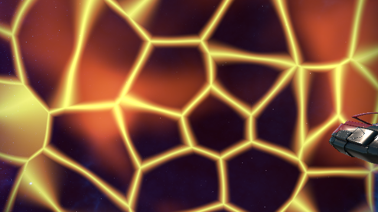
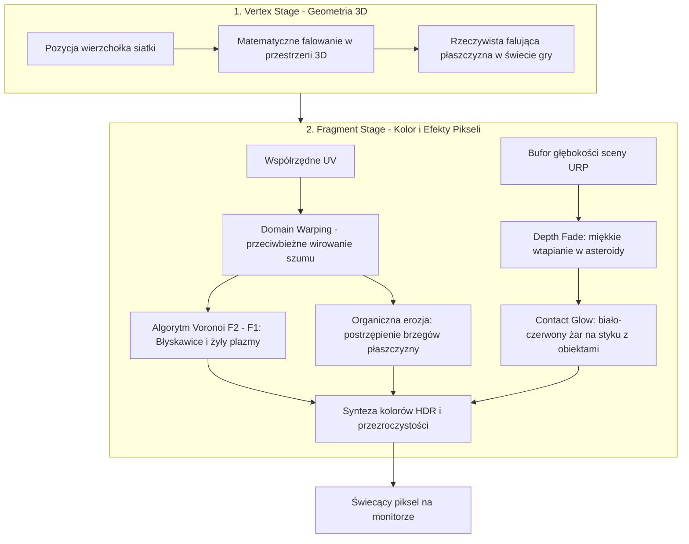

# Front Anihilacji – Raport z Tworzenia Dedykowanego Shadera URP HLSL

> [!IMPORTANT]
> **DOKUMENT POGLĄDOWO-EDUKACYJNY (DO PRACY INŻYNIERSKIEJ / DLA TWÓRCY)**
> Niniejszy raport oraz pliki w katalogu `Assets/DOCS/raports/` służą wyłącznie celom edukacyjnym i podglądowym dla użytkownika.
> **Agenci AI nie powinni ich analizować, traktować jako wymagań systemowych ani egzekwować jako reguł architektonicznych.**

---

---

## 1. Wstęp dla laika: Jak właściwie działa shader i GPU?

Jeśli nigdy wcześniej nie pisałeś shaderów, ten rozdział wyjaśni Ci najważniejsze zasady w prostych słowach.

### CPU vs GPU – dlaczego do grafiki potrzebujemy shadera?
* **CPU (procesor główny komputera):** To genialny matematyk, który robi rzeczy **sekwencyjnie** – linijka po linijce, bardzo szybko, ale po kolei. Znakomicie radzi sobie ze skomplikowaną logiką gry, fizyką i decyzjami.
* **GPU (karta graficzna):** To armia setek lub tysięcy prostych robotników, którzy pracują **jednocześnie (równolegle)**.
* Ekran w grze (np. rozdzielczość Full HD) to ponad **2 miliony pikseli**. Jeśli gra działa w 60 klatkach na sekundę, w każdej sekundzie karta graficzna musi policzyć kolor dla ponad **120 milionów punktów**!
* **Shader** to specjalny mikroprogram uruchamiany bezpośrednio na karcie graficznej. Karta odpala ten sam kod shadera dla każdego punktu siatki i każdego piksela na ekranie w tym samym ułamku milisekundy.

### Dwa kluczowe etapy każdego shadera 3D:
1. **Vertex Shader (Etap wierzchołków):**
   - Trójwymiarowe obiekty w grze (statki, asteroidy, płaszczyzny) składają się z punktów w przestrzeni zwanych **wierzchołkami** (vertices).
   - Vertex shader decyduje, gdzie dany wierzchołek znajduje się na ekranie. Może też fizycznie go przesunąć.
   - *W naszym shaderze:* Użyliśmy tego etapu, by siatka fali nie była płaska jak deska, lecz **falowała w 3D** w rytm funkcji matematycznych, symulując wzburzoną ścianę plazmy.
2. **Fragment / Pixel Shader (Etap pikseli):**
   - Gdy karta graficzna wie już, gdzie na ekranie leży trójkąt, uruchamia fragment shader dla każdego pojedynczego piksela, który ten trójkąt przykrywa.
   - Program odpowiada tylko na jedno pytanie: **„Jaki kolor (czerwony, zielony, niebieski) oraz jaką przezroczystość (alfa) ma mieć ten konkretny piksel w tej klatce?”**.
   - *W naszym shaderze:* To tutaj generujemy świecącą plazmę, sieć błyskawic, żarzenie przy uderzeniu w asteroidy i zanikanie krawędzi.

---

## 2. Dlaczego zwykła tekstura nie działała, a shader rozwiązuje problem?

Wcześniejsze podejście polegało na nałożeniu gotowego obrazka (tekstury 2D) na kwadratową płaszczyznę i przesuwaniu go w osi czasu. Efekt był sztuczny:
1. Obrazek powtarzał się w kółko jak tania tapeta na ścianie.
2. Płaszczyzna miała ostre, sztuczne krawędzie wielokąta tnące pustkę kosmiczną.
3. Gdy płaszczyzna przecinała skałę lub statek, na styku pojawiała się ostra linia cięcia geometrycznego (tzw. *knife-edge intersection*).

Dedykowany shader URP HLSL rozwiązuje te problemy w 100% matematycznie wewnątrz GPU.

---

## 3. Anatomia naszego shadera: Krok po kroku

### Krok 1: Płynna, kosmiczna plazma bez plików graficznych (Procedural Noise & Domain Warping)
* Zamiast wczytywać plik graficzny, shader wylicza szum matematyczny w locie.
* Wyobraź sobie dwie przezroczyste folie z dymem przesuwające się pod różnymi kątami z różną prędkością (`_Speed1` i `_Speed2`).
* Co więcej, pierwsza warstwa zniekształca współrzędne drugiej warstwy (**Domain Warping**). Sprawia to, że prądy plazmy zakręcają, tworząc dynamiczne wiry i fluktuacje, dokładnie tak jak na powierzchni burzliwych gwiazd.

### Krok 2: Sieć elektrycznych wyładowań (Voronoi $F_2 - F_1$)
* Wykres komórkowy Voronoi dzieli przestrzeń na komórki (jak plaster miodu lub spękana lawa).
* Dla każdego piksela algorytm sprawdza:
  - $F_1$ = odległość do najbliższego środka komórki.
  - $F_2$ = odległość do drugiego najbliższego środka.
* Na samej granicy między dwiema komórkami $F_2$ jest równe $F_1$, czyli różnica $F_2 - F_1 = 0$!
* Wykorzystujemy tę matematyczną cechę: piksele leżące blisko granicy ($F_2 - F_1 \approx 0$) rozjaśniamy do biało-złotego żaru HDR. W ten sposób powstaje rozgałęziona, pulsująca sieć żył elektrycznych i wyładowań rozdzielających ciemne rejony pustki.

### Krok 3: Organiczna erozja (Maskowanie kwadratu)
* Płaszczyzna w Unity to z natury prostokąt.
* W shaderze obliczamy odległość każdego piksela od geometrycznego środka. Im dalej od środka, tym piksel staje się bardziej przezroczysty.
* Dodatkowo brzeg ten modulujemy wcześniej obliczonym szumem plazmowym (`_EdgeNoiseDistortion`). Sprawia to, że brzegi płaszczyzny nie są równe ani owalne, lecz postrzępione, płomieniste i płynnie znikają w przestrzeni kosmicznej.

### Krok 4: Zmiękczanie kolizji i żarzenie kontaktowe (Depth Fade & Contact Glow)
* Unity w potoku URP tworzy specjalną teksturę zwaną buforem głębokości (`_CameraDepthTexture`), która pamięta, jak daleko od kamery znajduje się każdy nieprzezroczysty obiekt (asteroidy, kadłub statku gracza).
* W naszym shaderze pobieramy tę wartość i porównujemy:
  $$\text{Różnica głębokości} = \text{Głębokość asteroidy} - \text{Głębokość naszej fali}$$
* Gdy asteroida wnika w falę, różnica spada do zera. W tym miejscu shader nie rysuje ostrej krawędzi wielokąta, lecz rozpala intensywny, biało-czerwony pierścień żaru (`Contact Glow`). Wygląda to tak, jakby plazma trawiła i topiła materię skały w momencie kontaktu!

### Krok 5: Trójwymiarowe falowanie w przestrzeni (Vertex Undulation)
* W etapie wierzchołków (`vert`) wierzchołki siatki są delikatnie wypychane wzdłuż ich wektorów normalnych:
  $$\text{Przesunięcie} = \sin(\text{Czas} \cdot \text{Prędkość} + X) \cdot \cos(\text{Czas} \cdot \text{Prędkość} + Y) \cdot \text{Amplituda}$$
* Dzięki temu kurtyna energetyczna nie jest sztywnym arkuszem blachy, lecz faluje w przestrzeni 3D jak potężny kosmiczny żagiel solarny.

---

## 4. Warstwowa kompozycja w prefabie `AnnihilationWave.prefab`

Shader nie działa w próżni – stanowi centralną część wielowarstwowego systemu:

1. **Warstwa 1 (Front energetyczny):** `Energy_Curtain` ($450 \times 450\,\text{m}$) – nasz dedykowany shader URP HLSL z żyłami plazmy, żarzeniem kontaktowym i falowaniem wierzchołków.
2. **Warstwa 2 (Atmosfera plazmowa):** `Plasma_Clouds` ($500 \times 500\,\text{m}$) – trójwymiarowe, wolumetryczne chmury dymu unoszące się tuż za frontem.
3. **Warstwa 3 (Kosmiczna pustka):** `Void_Particle_Wall` ($700 \times 700\,\text{m}$) – gigantyczna czarna ściana cząsteczek całkowicie przesłaniająca gwiazdy w tle za falą.
4. **Warstwa 4 (Iskry bliskości):** `Proximity_Particles` ($140 \times 140\,\text{m}$) – podłużne, rozciągnięte w ruchu iskry, których tempo emisji rośnie, gdy fala dogania gracza.
5. **Warstwa 5 (Światło ostrzegawcze):** `Threat_Light` – punktowe źródło światła o zasięgu $300\,\text{m}$, które rzuca dynamiczny, pulsujący czerwony blask na kadłub statku i pobliskie asteroidy.

---

## 5. Jak dostroić efekt pod swój gust (Tabela parametrów w Inspektorze)

Wybierając materiał [`Assets/Materials/AnnihilationWave_Front_Mat.mat`](file:///c:/Users/ja/Documents/GitHub/AdAstra/Assets/Materials/AnnihilationWave_Front_Mat.mat) w Unity, możesz zmieniać poniższe suwaki bez dotykania kodu:

| Parametr w Inspektorze | Domyślna wartość | Za co odpowiada? (Jak to zmienić?) |
| :--- | :--- | :--- |
| **Deep Void Color** | Ciemny fiolet/czerń | Kolor wnętrza komórek (im ciemniejszy, tym większy kontrast z błyskawicami). |
| **Core Plasma Color** | Gorący pomarańcz HDR | Podstawowy kolor płynącego prądu plazmy. |
| **Electric Filament Web** | Złoto/Biel HDR | Kolor świecących żył i łuków elektrycznych. |
| **Contact Intersection Glow** | Jaskrawy biało-żółty HDR | Siła i kolor żarzenia na styku z asteroidami. |
| **Filament Web Scale** | `7.0` | Zagęszczenie siatki błyskawic (wyższa wartość = gęstsza, drobniejsza sieć żył). |
| **Filament Sharpness** | `4.5` | Grubość żył (wyższa wartość = cieńsze, ostrzejsze linie wyładowań). |
| **Turbulence Distortion** | `0.65` | Siła zawirowania plazmy (im wyższa, tym bardziej skręcone wiry). |
| **Edge Feathering Margin** | `0.45` | Szerokość miękkiego brzegu maskującego prostokątny kształt siatki. |
| **Edge Raggedness / Erosion** | `0.45` | Stopień poszarpania brzegu przez szum (daje organiczny, nieregularny kształt). |
| **Soft Intersection Distance** | `8.0` | Dystans w metrach, na jakim fala miękko wtapia się w skały bez ostrego odcięcia. |
| **3D Mesh Undulation Amplitude** | `2.5` | Wysokość falowania siatki 3D (falowanie powierzchni). |
